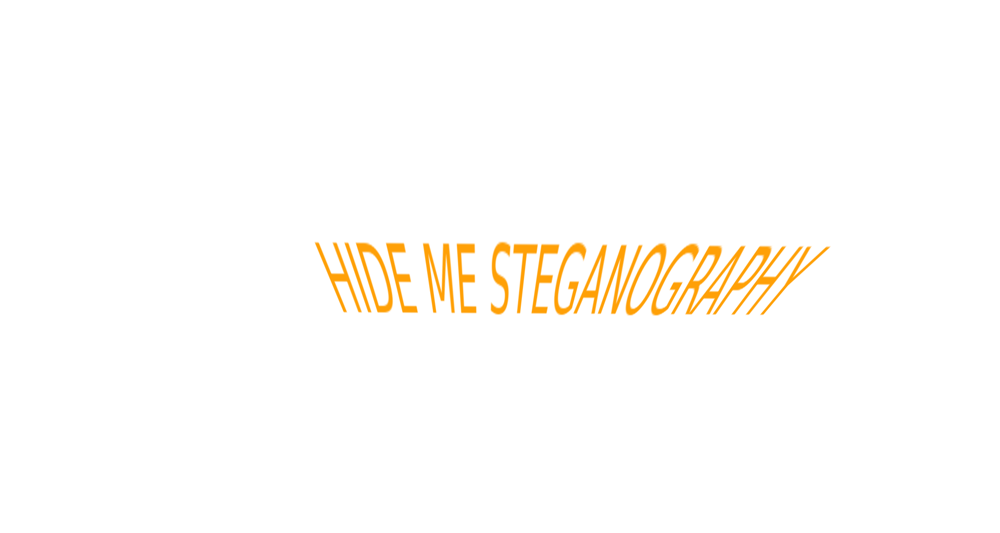

# Table of Contents

- [Features](#features)
- [Implementation details](#implementation-details)
- [Tech stack](#tech-stack)
  - [Frontend](#frontend)
  - [Backend](#backend)

## Features

- You can encode and decode secret text from images.
- You can hide encrypted text in other file formats and decode it when necessary.

## Implementation details

- The 'Least significant bit' approach was used to encode and decode text from images.
  More information on it may be found [here](https://www.researchgate.net/publication/328693051).

- When encoding/decoding text from other file formats, an affine cipher was used to hide/show the actual message, and the message itself was hidden at the end of the file.
  **\* This method is not advised for text files because it simply appends encrypted text at the end. \***

## Tech stack

### Frontend

- Javascript
- ReactJS

### Backend

- Python
- Django Rest Framework
- OpenCV
